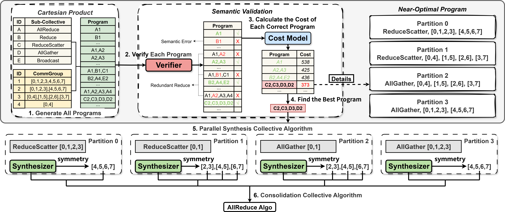

# Canvas: Scalable and Optimal Collective Communication Scheduling for Large-Scale GPU Clusters

<div align="center">

</img></div>

> **TACCL: Guiding Collective Algorithm Synthesis using Communication Sketches** <br/>
> Chenyang Hei, Yi Zhao, Fuliang Li, Chengxi Gao, Tongrui Liu, Xiuzhu Sha, Xingwei Wang<br/>
> **ICNP 2025** [https://ieeexplore.ieee.org/stamp/stamp.jsp?tp=&arnumber=11192367]

Canvas 是一种面向大规模 GPU 集群的可扩展集合通信调度框架。Canvas 能够针对任意层次化、带宽不均衡的网络拓扑，自动合成近似最优的集合通信算法，包括 AllReduce、AllGather 和 AllToAll 等。Canvas 采用分层合成方法，将全局调度问题划分为多个可处理的子问题，并通过多阶段集合分解生成结构化的通信程序。此外，Canvas 进一步引入跨微批次流水线调度机制，以提升链路利用率和跨通道、跨微批次的通信吞吐率。Canvas 最终输出经过优化的集合通信调度方案，并可将其下沉为硬件可执行的通信原语，通过 Microsoft Collective Communication Library (MSCCL) 运行时高效执行。

## 安装

### 前提条件
Canvas 复用了 [TACCL](https://github.com/microsoft/taccl) 的求解器, 因此需要 Gurobi 解决优化问题, 请在线获取 [Gurobi license](https://www.gurobi.com/downloads/) , 然后按以下步骤安装 Gurobi 许可工具。在 Anaconda 环境中运行
```
conda config --add channels http://conda.anaconda.org/gurobi
conda install -c conda-forge gurobi -y
<command to add Gurobi license>
```

### 安装步骤

```bash
# 克隆仓库
git clone https://github.com/Sibuge/Canvas.git
cd Canvas

# 安装依赖
pip install .
```

## 使用方法

Canvas 提供命令行工具, 通过以下命令使用：

```bash
# 求解集合通信算法
canvas search <topo> <coll> --topology-file <topo-file.json> --sketch-file <sketch.json>

# 转换为NCCL兼容格式, 无流水线优化
canvas ncclize <output.json> --instances <instances>

# 转换为NCCL兼容格式, 使用流水线优化
canvas ncclize-pipeline <output.json> --instances <instances>
```

### 示例
包含了一些示例, 可以在 `canvas/examples` 目录下找到：
- 拓扑示例 (`canvas/examples/topo/`)
- Sketch 示例 (`canvas/examples/sketch/`)

### 补充
有关 `topo` 和 `sketch` 的详细参数解释可参考 [TACCL README.md](https://github.com/microsoft/taccl/blob/main/README.md) 